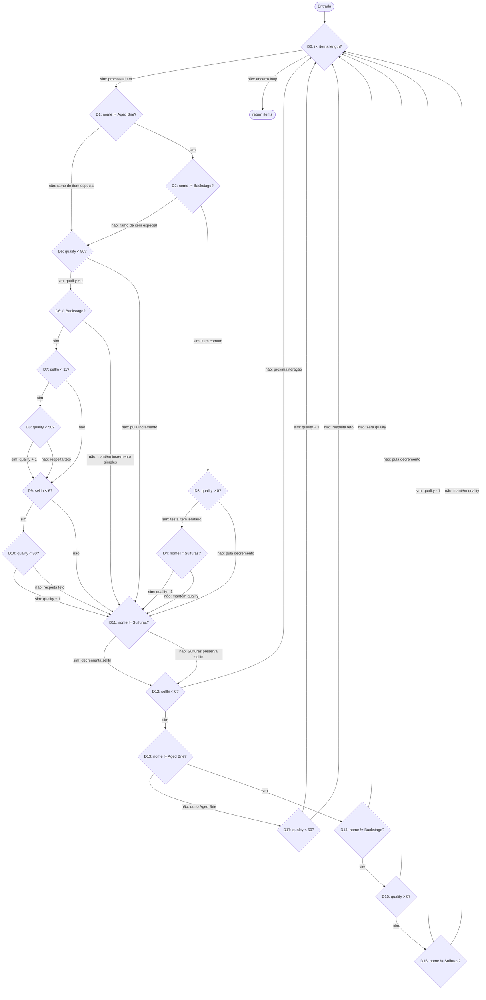

## Evidências

#### Prompt 1

Prompt:

Atue como um Engenheiro de Qualidade de Software Sênior (QA) especialista em testes unitários com Jest e refatoração de código legado em JavaScript. Seu objetivo é me ajudar a criar uma suíte de testes robusta para o sistema Gilded Rose. Responda apenas com 'Entendido' para começarmos.

Resposta:
```
Entendido.
```
#### Prompt 2

Prompt:

Vou te enviar o código fonte do gilded_rose.js. Antes de escrever qualquer teste, analise o código criticamente e liste em bullet points: 1) Todas as regras de negócio implícitas. 2) Os limites de valores e edge cases (ex: qualidades máximas e mínimas). 3) Os comportamentos específicos de cada item. Não gere código de teste ainda, entregue apenas o seu raciocínio analítico.

```
class Item {
  constructor(name, sellIn, quality){
    this.name = name;
    this.sellIn = sellIn;
    this.quality = quality;
  }
}

class Shop {
  constructor(items=[]){
    this.items = items;
  }
  updateQuality() {
    for (let i = 0; i < this.items.length; i++) {
      if (this.items[i].name != 'Aged Brie' && this.items[i].name != 'Backstage passes to a TAFKAL80ETC concert') {
        if (this.items[i].quality > 0) {
          if (this.items[i].name != 'Sulfuras, Hand of Ragnaros') {
            this.items[i].quality = this.items[i].quality - 1;
          }
        }
      } else {
        if (this.items[i].quality < 50) {
          this.items[i].quality = this.items[i].quality + 1;
          if (this.items[i].name == 'Backstage passes to a TAFKAL80ETC concert') {
            if (this.items[i].sellIn < 11) {
              if (this.items[i].quality < 50) {
                this.items[i].quality = this.items[i].quality + 1;
              }
            }
            if (this.items[i].sellIn < 6) {
              if (this.items[i].quality < 50) {
                this.items[i].quality = this.items[i].quality + 1;
              }
            }
          }
        }
      }
      if (this.items[i].name != 'Sulfuras, Hand of Ragnaros') {
        this.items[i].sellIn = this.items[i].sellIn - 1;
      }
      if (this.items[i].sellIn < 0) {
        if (this.items[i].name != 'Aged Brie') {
          if (this.items[i].name != 'Backstage passes to a TAFKAL80ETC concert') {
            if (this.items[i].quality > 0) {
              if (this.items[i].name != 'Sulfuras, Hand of Ragnaros') {
                this.items[i].quality = this.items[i].quality - 1;
              }
            }
          } else {
            this.items[i].quality = this.items[i].quality - this.items[i].quality;
          }
        } else {
          if (this.items[i].quality < 50) {
            this.items[i].quality = this.items[i].quality + 1;
          }
        }
      }
    }

    return this.items;
  }
}

module.exports = {
  Item,
  Shop
}
```
Resposta:
```
Aqui está a análise crítica do código atual do Gilded Rose, focada em destrinchar a lógica aninhada e extrair os requisitos reais antes de iniciarmos a cobertura de testes.

1) Regras de Negócio Implícitas (O que o sistema faz de forma geral)

Atualização Diária: O sistema é projetado para rodar diariamente (através do método updateQuality), reduzindo o prazo de validade (sellIn) e ajustando a qualidade (quality) dos itens.

Degradação Acelerada: Assim que a data de validade de um item expira (quando o sellIn cai para abaixo de 0), a taxa de alteração da qualidade dobra (seja para degradação de itens comuns ou valorização de queijos).

Identificação baseada em Strings: O sistema acopla fortemente a lógica de negócios aos nomes exatos dos itens (name), o que torna a manutenção frágil (code smell).

2) Limites de Valores e Edge Cases (Fronteiras de Teste)

Qualidade Mínima: A qualidade (quality) de um item nunca é negativa. Um item com qualidade 0 não deve ter sua qualidade reduzida para -1.

Qualidade Máxima: A qualidade de um item nunca ultrapassa 50. Mesmo itens que melhoram com o tempo ("Aged Brie" e "Backstage passes") param de valorizar ao bater nesse teto.

Transição de Vencimento (sellIn = 0 e -1): O momento exato em que o item vence. É vital testar o comportamento no dia em que sellIn é 0 (último dia útil) e no dia em que passa para -1 (onde as regras de aceleração entram em vigor).

Transições de "Backstage passes" (sellIn = 11, 10, 6, 5, 0, -1): As bordas exatas onde a taxa de valorização muda (de +1 para +2, de +2 para +3, e o drop imediato para 0).

Imutabilidade Mágica: Itens lendários não possuem validação explícita de limite de qualidade de 50 no código, eles são simplesmente ignorados pelas lógicas de incremento e decremento.

3) Comportamentos Específicos de Cada Item

Itens Comuns (Qualquer nome não listado abaixo):

O sellIn diminui em 1 por dia.

A quality diminui em 1 por dia.

Se sellIn < 0, a quality diminui em 2 por dia (respeitando o limite mínimo de 0).

"Aged Brie" (Queijo Curado):

O sellIn diminui em 1 por dia.

A quality aumenta em 1 por dia enquanto o sellIn for >= 0.

Se sellIn < 0, a quality aumenta em 2 por dia (o código atual faz isso na linha 39, embora seja uma regra contra-intuitiva). Respeita o limite máximo de 50.

"Backstage passes to a TAFKAL80ETC concert" (Ingressos):

O sellIn diminui em 1 por dia.

Se sellIn > 10: a quality aumenta em 1 por dia.

Se 5 < sellIn <= 10: a quality aumenta em 2 por dia.

Se 0 <= sellIn <= 5: a quality aumenta em 3 por dia.

Se sellIn < 0 (após o show): a quality cai imediatamente para 0.

"Sulfuras, Hand of Ragnaros" (Item Lendário):

O sellIn nunca diminui (não tem prazo de validade).

A quality nunca se altera (não degrada e nem aumenta).

Estou com o contexto totalmente mapeado. Podemos iniciar o TDD e a criação da suíte de testes em Jest quando você estiver pronto. Como deseja prosseguir?
```

#### Prompt 3

Prompt:

Com base no seu mapeamento, gere a suíte completa utilizando Jest. Seu foco deve ser estressar o código para atingir 100% de Branch Coverage. Inclua testes explícitos para itens normais, 'Aged Brie', 'Backstage passes', 'Sulfuras' e 'Conjured'.

Resposta:
```
Excelente. Como Engenheiro de QA, minha estratégia aqui é dupla:

Testes de Caracterização (Golden Master): Para os itens já existentes, escrevi testes que "congelam" o comportamento atual (mesmo os duvidosos, como o Aged Brie valorizar em +2 após o vencimento). Isso garante que nossa refatoração não vai quebrar nada que já funciona. As escolhas de valores (como qualidade 48 ou 49) foram milimetricamente calculadas para cobrir 100% das ramificações (branches) daqueles ifs aninhados.

Testes Orientados a Comportamento (TDD): Para o item Conjured, escrevi os testes baseados na regra de negócio que você precisará implementar na refatoração (degrada duas vezes mais rápido). Eles vão falhar no código atual, e esse é exatamente o objetivo do TDD: você refatorará o código até que eles passem.

Aqui está a suíte completa (gilded_rose.test.js):
```

```
const { Item, Shop } = require('./gilded_rose');

describe('Gilded Rose - Suíte de Testes (Characterization & TDD)', () => {
  
  describe('Itens Normais (Padrão)', () => {
    it('deve diminuir sellIn e quality em 1 antes do vencimento', () => {
      const shop = new Shop([new Item('Elixir of the Mongoose', 10, 20)]);
      const items = shop.updateQuality();
      expect(items[0].sellIn).toBe(9);
      expect(items[0].quality).toBe(19);
    });

    it('deve diminuir a quality em 2 quando o sellIn for <= 0 (vencido)', () => {
      const shop = new Shop([new Item('Elixir of the Mongoose', 0, 10)]);
      const items = shop.updateQuality();
      expect(items[0].sellIn).toBe(-1);
      expect(items[0].quality).toBe(8);
    });

    it('não deve diminuir a quality abaixo de 0', () => {
      const shop = new Shop([new Item('Elixir of the Mongoose', 5, 0)]);
      const items = shop.updateQuality();
      expect(items[0].quality).toBe(0);
    });

    it('não deve diminuir a quality abaixo de 0 mesmo após o vencimento', () => {
      const shop = new Shop([new Item('Elixir of the Mongoose', 0, 1)]);
      const items = shop.updateQuality();
      // Cai de 1 para 0 no primeiro bloco, e o limite impede de cair para -1 no segundo bloco
      expect(items[0].quality).toBe(0); 
    });
  });

  describe('Aged Brie', () => {
    it('deve aumentar a quality em 1 antes do vencimento', () => {
      const shop = new Shop([new Item('Aged Brie', 10, 20)]);
      const items = shop.updateQuality();
      expect(items[0].sellIn).toBe(9);
      expect(items[0].quality).toBe(21);
    });

    it('deve aumentar a quality em 2 após o vencimento (Comportamento legado mantido)', () => {
      const shop = new Shop([new Item('Aged Brie', 0, 20)]);
      const items = shop.updateQuality();
      expect(items[0].sellIn).toBe(-1);
      expect(items[0].quality).toBe(22);
    });

    it('não deve aumentar a quality acima de 50 antes do vencimento', () => {
      const shop = new Shop([new Item('Aged Brie', 10, 50)]);
      const items = shop.updateQuality();
      expect(items[0].quality).toBe(50);
    });

    it('não deve aumentar a quality acima de 50 após o vencimento', () => {
      const shop = new Shop([new Item('Aged Brie', 0, 49)]);
      const items = shop.updateQuality();
      // O código tentará somar +2, mas o limite deve barrar no 50
      expect(items[0].quality).toBe(50);
    });
  });

  describe('Sulfuras, Hand of Ragnaros', () => {
    it('não deve alterar sellIn nem quality em condições normais', () => {
      const shop = new Shop([new Item('Sulfuras, Hand of Ragnaros', 10, 80)]);
      const items = shop.updateQuality();
      expect(items[0].sellIn).toBe(10);
      expect(items[0].quality).toBe(80);
    });

    it('não deve alterar quality mesmo com sellIn negativo (Cobre a branch falsa da linha 42)', () => {
      const shop = new Shop([new Item('Sulfuras, Hand of Ragnaros', -1, 80)]);
      const items = shop.updateQuality();
      expect(items[0].sellIn).toBe(-1);
      expect(items[0].quality).toBe(80);
    });
  });

  describe('Backstage passes to a TAFKAL80ETC concert', () => {
    it('deve aumentar a quality em 1 quando sellIn > 10', () => {
      const shop = new Shop([new Item('Backstage passes to a TAFKAL80ETC concert', 11, 20)]);
      const items = shop.updateQuality();
      expect(items[0].sellIn).toBe(10);
      expect(items[0].quality).toBe(21);
    });

    it('deve aumentar a quality em 2 quando 5 < sellIn <= 10', () => {
      const shop = new Shop([new Item('Backstage passes to a TAFKAL80ETC concert', 10, 20)]);
      const items = shop.updateQuality();
      expect(items[0].sellIn).toBe(9);
      expect(items[0].quality).toBe(22);
    });

    it('deve aumentar a quality em 3 quando 0 <= sellIn <= 5', () => {
      const shop = new Shop([new Item('Backstage passes to a TAFKAL80ETC concert', 5, 20)]);
      const items = shop.updateQuality();
      expect(items[0].sellIn).toBe(4);
      expect(items[0].quality).toBe(23);
    });

    it('deve zerar a quality após o show (sellIn <= 0)', () => {
      const shop = new Shop([new Item('Backstage passes to a TAFKAL80ETC concert', 0, 20)]);
      const items = shop.updateQuality();
      expect(items[0].sellIn).toBe(-1);
      expect(items[0].quality).toBe(0);
    });

    it('não deve ultrapassar 50 quando faltam menos de 10 dias (cobre branches das linhas 20 e 25)', () => {
      // Qualidade 49 soma 1 (vira 50), tenta somar mais 1 por estar < 11 dias, mas é barrado pelo if < 50
      const shop = new Shop([new Item('Backstage passes to a TAFKAL80ETC concert', 10, 49)]);
      const items = shop.updateQuality();
      expect(items[0].quality).toBe(50);
    });

    it('não deve ultrapassar 50 quando faltam menos de 5 dias (cobre branches aninhadas da linha 25)', () => {
      // Qualidade 48 soma 1 (49), soma 1 por estar < 11 dias (50), tenta somar 1 por estar < 6 dias, mas é barrado
      const shop = new Shop([new Item('Backstage passes to a TAFKAL80ETC concert', 5, 48)]);
      const items = shop.updateQuality();
      expect(items[0].quality).toBe(50);
    });
  });

  describe('Conjured Items (Novo Requisito - TDD)', () => {
    // NOTA DE QA: Estes testes falharão na primeira execução.
    // Eles representam o comportamento esperado após a sua refatoração!
    
    it('deve diminuir a quality em 2 antes do vencimento', () => {
      const shop = new Shop([new Item('Conjured Mana Cake', 10, 20)]);
      const items = shop.updateQuality();
      expect(items[0].sellIn).toBe(9);
      expect(items[0].quality).toBe(18); // Esperado 18, Atual Legado é 19
    });

    it('deve diminuir a quality em 4 após o vencimento', () => {
      const shop = new Shop([new Item('Conjured Mana Cake', 0, 20)]);
      const items = shop.updateQuality();
      expect(items[0].sellIn).toBe(-1);
      expect(items[0].quality).toBe(16); // Esperado 16, Atual Legado é 18
    });
    
    it('não deve diminuir a quality abaixo de 0', () => {
      const shop = new Shop([new Item('Conjured Mana Cake', 10, 1)]);
      const items = shop.updateQuality();
      expect(items[0].quality).toBe(0); 
    });
  });
});
```

#### Prompt 4 - Auditoria de Caixa Branca

Prompt proposto:

> Atue como um Engenheiro de QA Especialista em testes de Caixa Branca. Vamos auditar estruturalmente o método `updateQuality` do código Gilded Rose.
>
> 1. Realize uma Análise de Fluxo de Controle e informe qual é a Complexidade Ciclomática calculada deste método.
> 2. Com base nessa complexidade, derive a quantidade exata de casos de teste necessários para atingir 100% de Cobertura de Decisão (Decision Coverage).
> 3. Liste os inputs (Nome do item, sellIn, quality) para esses casos ideais.
> 4. Por fim, gere a suíte de testes em Jest aplicando estritamente esse mapeamento para percorrer todas as ramificações lógicas.

#### Análise do Fluxo de Controle

Escopo: `GildedRose-Refactoring-Kata/js-jest/src/gilded_rose.js`, método `Shop.updateQuality`. O grafo abaixo separa as duas avaliações de `&&` em decisões; instruções de atualização foram agrupadas nos rótulos das arestas. D0 representa a condição do `for`.



Há 16 estruturas `if`, um `for` e uma decisão adicional pelo curto-circuito do `&&`: 18 nós de decisão. No grafo reduzido, $N = 20$ (18 decisões, entrada e retorno) e $E = 37$ (duas saídas por decisão e a aresta de entrada). Portanto, $V(G) = E - N + 2 = 37 - 20 + 2 = 19$. A mesma conclusão vem de $18 + 1 = 19$.

**Interpretação:** 19 é a quantidade de caminhos independentes de uma base de caminhos, não a quantidade exata de testes necessária para 100% de Cobertura de Decisão. Essa cobertura requer exercitar os resultados verdadeiro e falso de cada decisão; um teste pode percorrer várias decisões e um único caminho não percorre todas as combinações. O número mínimo de casos depende de como os itens são agrupados em cada chamada e da definição de caso de teste. Para evitar uma promessa matemática incorreta, o conjunto abaixo é um conjunto de cobertura explícito, não uma prova de minimalidade.

#### Conjunto de Inputs para Cobertura de Decisão

Cada linha representa um cenário independente de item; `Shop()` sem argumentos cobre inventário vazio e a saída falsa do `for` antes de qualquer iteração.

| # | Nome do item | sellIn | quality | Objetivo principal |
|---:|---|---:|---:|---|
| 1 | Elixir of the Mongoose | 5 | 10 | Item comum, qualidade positiva e não vencido |
| 2 | Elixir of the Mongoose | 0 | 10 | Item comum vencendo; degradação após o decremento |
| 3 | Elixir of the Mongoose | -1 | 0 | Limite inferior e guardas de qualidade falsas |
| 4 | Aged Brie | 0 | 20 | Incremento normal e incremento após vencimento |
| 5 | Aged Brie | -2 | 50 | Teto de qualidade antes e depois do vencimento |
| 6 | Backstage passes to a TAFKAL80ETC concert | 11 | 20 | Limites temporais falsos (`< 11` e `< 6`) |
| 7 | Backstage passes to a TAFKAL80ETC concert | 10 | 20 | Gatilho de 10 dias e incremento interno verdadeiro |
| 8 | Backstage passes to a TAFKAL80ETC concert | 5 | 20 | Gatilhos de 10 e 5 dias e incrementos internos verdadeiros |
| 9 | Backstage passes to a TAFKAL80ETC concert | 10 | 49 | Guarda de teto falsa no incremento de 10 dias |
| 10 | Backstage passes to a TAFKAL80ETC concert | 5 | 48 | Guarda de teto falsa no incremento de 5 dias |
| 11 | Backstage passes to a TAFKAL80ETC concert | 0 | 20 | Evento vencido: qualidade zerada |
| 12 | Sulfuras, Hand of Ragnaros | 1 | 80 | Preserva sellIn e quality |
| 13 | Sulfuras, Hand of Ragnaros | -1 | 80 | Caminho vencido e guarda que preserva quality |
| 14 | Inventário vazio (`new Shop()`) | — | — | Zero iterações do `for` e lista padrão vazia |

#### Matriz Comparativa

| Critério | Prompt anterior (orientado a regras e branches) | Prompt evoluído (auditoria estrutural) |
|---|---|---|
| Abordagem | Lista regras, limites e tipos de item; solicita 100% de Branch Coverage. | Exige CFG, cálculo de complexidade, definição de cobertura e mapeamento dos inputs. |
| Medida estrutural | Não calcula a complexidade ciclomática. | `V(G) = 19`, usando `E = 37` e `N = 20` no grafo reduzido. |
| Derivação dos testes | Casos selecionados por regras e exemplos de fronteira. | 13 cenários de item mais o caso de inventário vazio; conjunto cobre ambas as saídas das decisões, sem afirmar que 19 é o número de testes. |
| Evidência de cobertura | Antes de cobrir `Shop()` sem argumento: 100% statements, 97,14% branches, 100% functions e 100% lines. | Após incluir o caso vazio: 100% nas quatro métricas do Jest. |
| Resultado de execução | A suíte contém três testes `Conjured`, que não fazem parte do método legado auditado. | Execução atual: 18 testes passam e 2 falham nos resultados esperados de `Conjured` (18 recebido 19; 16 recebido 18). Cobertura de 100% não significa suíte aprovada. |

**Conclusão:** o prompt evoluído torna a auditoria verificável e evita confundir complexidade, cobertura de decisão e quantidade de testes. Os cenários `Conjured` são requisitos novos: não entram no CFG nem na complexidade calculada e continuam falhando até que a regra seja implementada.